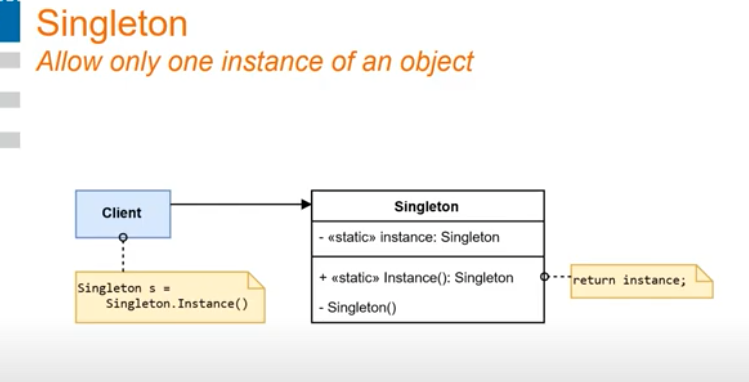
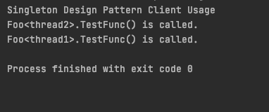

# Singleton Design Pattern Development Notes: 

- There should be NO `copy constructor` and `copy assignment` operator. 
- getter of the instance method should be `static` to make it accessable from anywhere. 
- static methods should be implemented outside of the class definition. 
- static variables should be initialized 

## Problems: 

- The first issue with Singleton design pattern in multithreading usage: 

Even the system needs to have only one instance of the Foo class, it has two instance of it because of race condition. 

